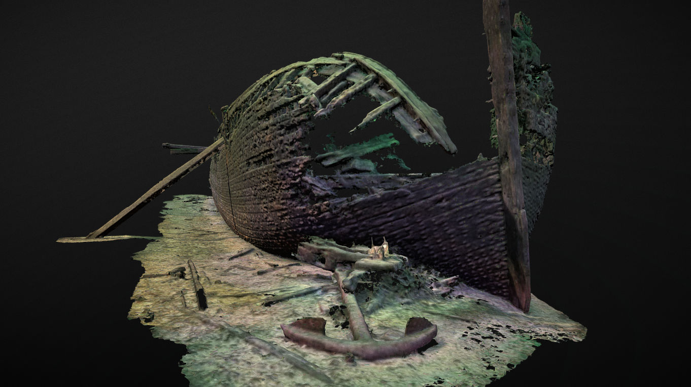

# Robert Gaskin Wreck

Robert Gaskin's shipwreck 3D models

## Survey facts

Images gathered between 2019-05-11 and 2019-08-24

19 dives and 37 hours 20 minutes spent underwater at the wreck to gather images

10 hours 9 minutes of 4k video gathered with a GoPro Hero 6 Black camera, and 2 15 000 lumens BigBlue video lights.

48 977 images extracted from the video files where used in a photogrammetry process to produce the 3D model.

All survey data weights 1.6To (or 1 600 Gigs)

## Data Availability
